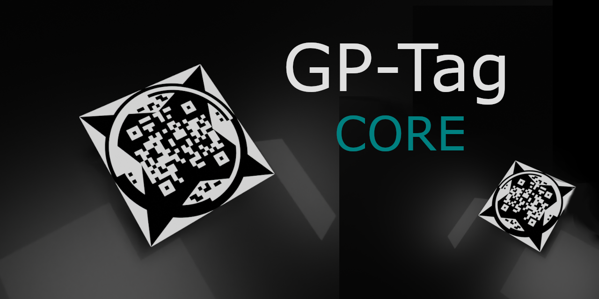

# GP-Tag (Global Positioning Tag)

GP-Tag is a novel fiducial marker system that encodes global position data (latitude, longitude, altitude) along with orientation information directly within the marker pattern. This system enables robots and autonomous systems to determine both their global position and relative pose from a single marker detection.

## Related Repositories
- [GP-Tag](https://github.com/S-SB/gp-tag) - This repository (core implementation)
- [GP-Tag ROS2](https://github.com/S-SB/gp-tag-ros2) - ROS2 integration package
- [GP-Tag Mobile](https://github.com/S-SB/gp-tag-mobile) - Mobile implementation

## Features
- Encodes global position (latitude, longitude, altitude)
- Stores orientation data using quaternions
- Provides 6-DoF pose estimation in NED frame
- Supports scale information for varying physical sizes
- Includes error correction using Reed-Solomon encoding
- Works without internet connectivity or external databases

## Project Structure
```
gptag/
├── decoder/                    # Detection and decoding modules
│   ├── annuli_decoder.py      # Orientation refinement using annuli patterns
│   ├── data_decoder.py        # Data extraction and error correction
│   ├── finder_decoder.py      # Finder pattern validation
│   ├── sift_detector.py       # SIFT-based detection pipeline
│   ├── spike_detector.py      # Corner refinement
│   ├── GP-Tag_Demo_Decoder.py # Demo script with example usage
│   └── tag3_blank_360.png     # Reference template
│
└── encoder/                    # Tag generation
    ├── GP-Tag_Generator.py    # GUI for tag generation
    └── tag_encoder.py         # Core encoding functions
```

## Installation

### Dependencies
```bash
pip install numpy opencv-python pillow reedsolo
```

### Optional Dependencies
- For GUI tag generation: `tkinter`
- For ROS2 integration: See [GP-Tag ROS2](https://github.com/S-SB/gp-tag-ros2)
- For mobile deployment: See [GP-Tag Mobile](https://github.com/S-SB/gp-tag-mobile)

## Basic Usage

### Generating Tags
```python
from gptag.encoder.tag_encoder import create_fiducial_marker

# Example: Create a tag for a specific location
tag = create_fiducial_marker(
    latitude=63.8203894,
    longitude=20.3058847,
    altitude=45.16,
    quaternion=[0.707, 0, 0.707, 0],  # NED frame quaternion
    scale=0.36,  # cells/mm
    accuracy=2,  # 0-3 level
    tag_id=123,
    version_id=3,
    U=40  # Base unit size in pixels
)

# Save the generated tag
tag.save("gptag_123.png")
```

### Detecting Tags

GP-Tag provides a complete demo script and example images to help you get started. The detection pipeline uses SIFT features with multiple refinement stages to achieve robust tag detection and accurate pose estimation in the NED frame.

#### Quick Start with Demo
```python
# Run the included demo script
python gptag/decoder/GP-Tag_Demo_Decoder.py
```

The demo script showcases:
- Complete tag detection pipeline using included test image
- Real-time visualization showing detection and rectified tag
- Comprehensive output including:
  - Tag global position and orientation
  - Camera pose in NED frame
  - Observer's calculated global position
  - Detailed timing statistics

#### Custom Implementation
```python
from gptag.decoder.sift_detector import SIFTDetector6DoF
import cv2
import numpy as np

# Initialize detector
detector = SIFTDetector6DoF()

# Load your image
image = cv2.imread("your_image.png")

# Set up camera parameters (example for 1920x1080 camera)
camera_matrix = np.array([
    [961.267, 0, 964.3],
    [0, 961.267, 538.868],
    [0, 0, 1]
])
dist_coeffs = np.zeros(5)  # Adjust based on your camera calibration

# Run detection
results = detector.detect(
    image=image,
    camera_matrix=camera_matrix,
    dist_coeffs=dist_coeffs,
    debug_info=True
)

if results:
    print("\nTag Global Position:")
    print(f"Latitude:  {results['tag_data']['latitude']:.6f}°")
    print(f"Longitude: {results['tag_data']['longitude']:.6f}°")
    print(f"Altitude:  {results['tag_data']['altitude']:.1f}m")
    
    print("\nCamera-Tag Relative Pose (NED frame):")
    print(f"Position [north, east, down]: {results['position']}")
    print(f"Rotation quaternion [x,y,z,w]: {results['rotation']}")
```

#### Creating Test Images
1. Generate a GP-Tag using the encoder
2. Use Blender or similar 3D software:
   - Import tag as plane/image texture
   - Set up tag and camera positions
   - Configure lighting and background
   - Record ground truth pose data
3. Render for testing

#### Coordinate System
GP-Tag uses the NED (North-East-Down) coordinate frame with specific conventions:

Reference pose (0,0,0):
- Tag lying flat on ground (Z axis pointing down)
- Tag's right edge aligned with North (X axis)
- Tag's top edge aligned with East (Y axis)
- Down axis following right-hand rule (Z axis)

Conventions:
- Position vectors: [north, east, down] in meters
- Quaternions: [x, y, z, w] format
- Euler angles: [roll, pitch, yaw] in degrees
  - Roll: Rotation around North axis (X)
  - Pitch: Rotation around East axis (Y), **negated in NED frame**
  - Yaw: Rotation around Down axis (Z)

Note: When converting quaternions to Euler angles in NED frame, the pitch angle must be negated to maintain consistency with standard navigation conventions. This is handled automatically in the provided `quaternion_to_euler_NED()` function in the demo code.

## Performance

Testing was conducted across 1,000 synthetic frames generated in Blender with varying conditions.

### Detection Pipeline
- Decoding success rate: 66.3%
- Average processing time: 350.8 ± 72.9 ms

### Pose Estimation Accuracy
- Translation errors: 11-76 cm mean error across axes
- Rotation errors: 1.9-5.7° mean error across axes
- Strong performance in yaw estimation (1.9° mean error)

Note: This represents early-stage testing results. Further optimization of the detection pipeline is ongoing, with potential improvements in both speed and accuracy expected in future releases. 

Known Issue: There is currently a bug affecting translation estimation in the ROS2 and mobile implementations. This is under investigation and a fix will be released soon.

## Technical Documentation
For detailed technical specifications, see [GP-Tag Technical Specification](docs/GP-Tag_Technical_Specification.pdf).

## License
MIT License. See [LICENSE](LICENSE) file for details.

## Author
S. E. Sundén Byléhn

## Citation
If you use GP-Tag in your research, please cite:
```bibtex
@misc{gptag2024,
  author = {Sundén Byléhn, S. E.},
  title = {GP-Tag: A Universal Fiducial Marker Framework},
  year = {2024},
  publisher = {GitHub},
  url = {https://github.com/S-SB/gp-tag}
}
```